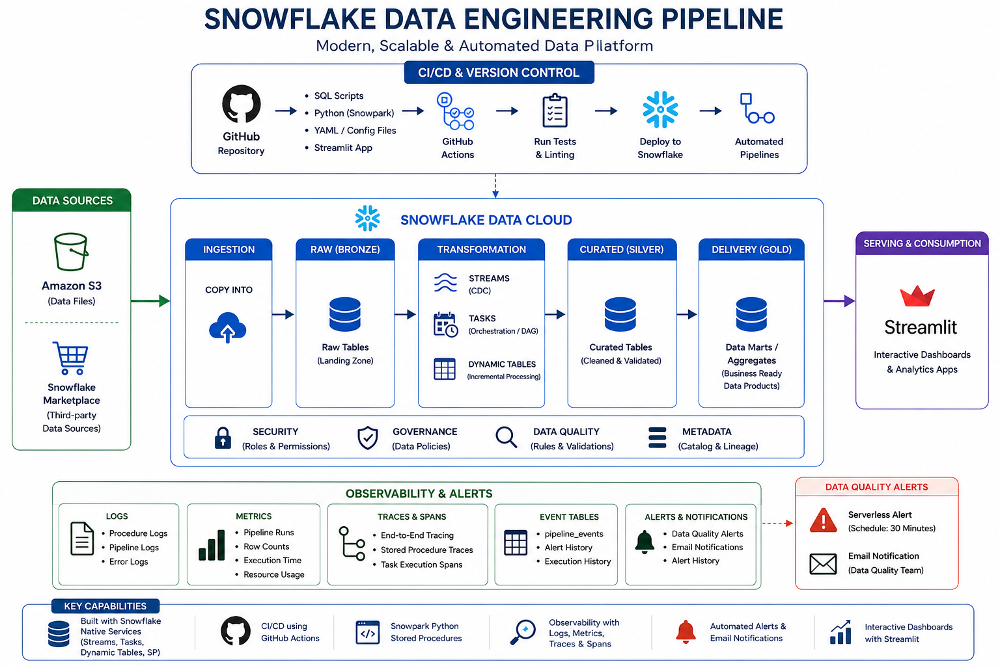

# Snowflake Data Engineering Pipeline 🚀

An end-to-end cloud-native Data Engineering project built on Snowflake to explore modern analytics engineering workflows including data ingestion, transformation, orchestration, observability, CI/CD, and reporting.

---

# 📌 Project Overview

This project demonstrates how modern data pipelines can be designed and managed using Snowflake and cloud-native tooling.

The pipeline includes:

- Data ingestion and transformation using SQL & Python
- Incremental processing with Streams and Tasks
- Dynamic Tables for automated transformations
- Snowpark Python stored procedures
- CI/CD automation using GitHub Actions and Snowflake CLI
- Data quality monitoring and automated email alerts
- Observability using logs, traces, spans, and event tables
- Streamlit dashboard for analytics and visualization

---

# 🏗️ Architecture

The pipeline follows a modular cloud-native architecture:

1. Source data ingestion into Snowflake
2. Transformation and processing using SQL + Snowpark
3. Incremental updates using Streams & Tasks
4. Automated orchestration workflows
5. Data quality validation and monitoring
6. Observability tracking using event tables and logs
7. Dashboard visualization using Streamlit

  

